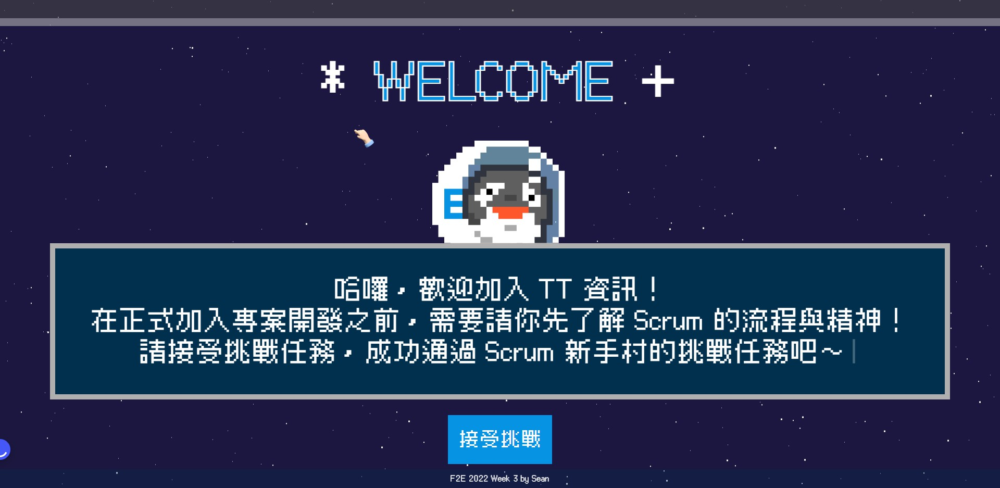

# f2e_2022_week3_sean
# 

[網站連結](https://lashawty.github.io/f2e_2022_week2_sean/)

# ** 請使用1920x1080解析度預覽**

# 專案說明：

- html(pug)為index

- css(sass) 
    1. component 共用元件
    1. font 字級設定
    1. loading 動畫元素
    1. main 各區塊樣式設定
    1. reset

- JS
    1. jQuery
    1. 原生JS
    1. GSAP
    1. Sortable.js
    1. cotton.js

# 互動說明

1. 多個點擊顯示對話框
2. 拖拉功能
3. 複選題
4. 僅在同個頁面開發，點擊"<"並不會回到預設值(考量使用者也許只是回頭複習，並不是想重做)
5. HAVE FUN !!
